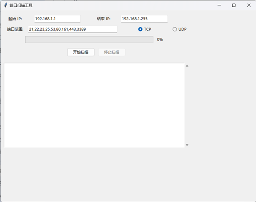
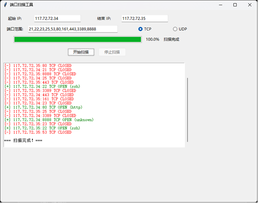

## 项目介绍
基于Python实现的具有图形界面的端口扫描工具 含报告

### 功能

-	支持IP地址范围扫描。
-	支持多端口扫描。
-	支持TCP和UDP协议扫描。
-	具备进度显示功能。
-	实时显示扫描结果。

### 主要库依赖:
- tkinter：用于构建图形用户界面（GUI）。
- socket：用于实现网络通信。
- threading：用于实现多线程扫描。
- queue：用于线程间通信。
- ipaddress：用于处理IP地址范围。

## 程序截图

